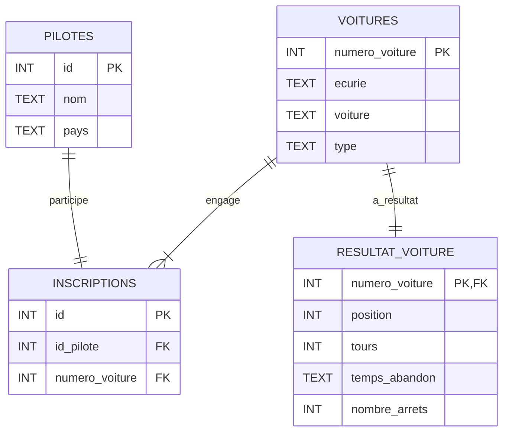

# SQl

# 🏁 Base de Données – 24 Heures du Mans 2024

## Objectif du Projet

Ce projet a pour but de modéliser les résultats de la course automobile des 24 Heures du Mans 2024 à travers une base de données relationnelle. L’objectif est de permettre une analyse simple et efficace des performances des voitures hypercars, des écuries et des pilotes.

## Portée

La base de données couvre les aspects suivants :
- Les voitures engagées dans la course
- Les pilotes et leurs nationalités
- Les inscriptions des pilotes par voiture
- Les résultats de course (positions, tours, abandons, arrêts, etc.)

##  Modèle Conceptuel : Entités et Relations


## Choix de Conception

- Normalisation : séparation des entités pour éviter la redondance.
- Relation N-N entre pilotes et voitures via la table d’inscriptions.
- Intégrité des données assurée par des clés étrangères (FOREIGN KEY).
- Flexibilité : extensible à plusieurs éditions ou d’autres compétitions.
- Performance : requêtes analytiques courantes prévues dès la conception.

## Limitations

- Données limitées à une seule édition de la course.
- temps_abandon est une chaîne de caractères : traitement temporel non optimal.
- Pas de gestion de l’année ou du contexte de la course (météo, incidents, etc.).

## Requêtes SQL Clés
### 1. Lister tous les pilotes et leur nationalité, triés par pays
```sql
SELECT nom, pays
FROM pilotes
ORDER BY pays, nom;
```
### 2. Afficher toutes les voitures avec leur écurie et leur type
```sql
SELECT numero_voiture, écurie, voiture, type
FROM voitures
ORDER BY écurie;
```
### 3. Voir les voitures ayant terminé la course (hors abandons / non classés)
```sql
SELECT numero_voiture, position, tours, temps_abandon
FROM resultat_voiture
WHERE temps_abandon NOT IN ('Abandon', 'Non classé')
ORDER BY position ASC;
```
### 4. Afficher les voitures qui ont abandonné la course ou sont non classées
```sql
SELECT numero_voiture, tours, temps_abandon
FROM resultat_voiture
WHERE temps_abandon IN ('Abandon', 'Non classé')
ORDER BY tours DESC;
```
### 5. Associer chaque pilote à la voiture et à l’écurie avec lesquelles il a participé
```sql
SELECT p.nom, v.voiture, v.écurie
FROM inscriptions i
JOIN pilotes p ON i.id_pilote = p.id
JOIN voitures v ON i.numero_voiture = v.numero_voiture;
```
### 6. Calculer le nombre moyen d’arrêts aux stands selon le type de voiture
```sql
SELECT v.type, AVG(rv.nombre_arrets) AS arrets_moyens
FROM voitures v
JOIN resultat_voiture rv ON v.numero_voiture = rv.numero_voiture
GROUP BY v.type;
```
### 7. Lister les voitures avec le nombre de pilotes qui y sont inscrits
```sql
SELECT v.numero_voiture, v.voiture, v.écurie, COUNT(i.id_pilote) AS nb_pilotes
FROM voitures v
JOIN inscriptions i ON v.numero_voiture = i.numero_voiture
GROUP BY v.numero_voiture, v.voiture, v.écurie
ORDER BY nb_pilotes DESC;
```
### 8. Moyenne de tours parcourus par type de voiture (LMH, LMDh)
```sql
SELECT v.type, AVG(rv.tours) AS moyenne_tours
FROM voitures v
JOIN resultat_voiture rv ON v.numero_voiture = rv.numero_voiture
GROUP BY v.type
ORDER BY moyenne_tours DESC;
```
### 9. Top 5 des voitures ayant effectué le plus d’arrêts aux stands
```sql
SELECT numero_voiture, nombre_arrets
FROM resultat_voiture
ORDER BY nombre_arrets DESC
LIMIT 5;
```
### 10. Afficher les pilotes avec la voiture qu'ils ont conduite, sa position finale et le nombre de tours
```sql
SELECT p.nom, v.voiture, rv.position, rv.tours
FROM inscriptions i
JOIN pilotes p ON i.id_pilote = p.id
JOIN voitures v ON i.numero_voiture = v.numero_voiture
JOIN resultat_voiture rv ON v.numero_voiture = rv.numero_voiture
ORDER BY rv.position;
```

## Perspectives d'améliorations

Cette base peut être enrichie avec :
- D’autres éditions des 24h du Mans
- Des données de télémétrie (vitesses, temps au tour…)
- Des événements de course (accidents, safety cars…)
- Des informations sur les circuits


